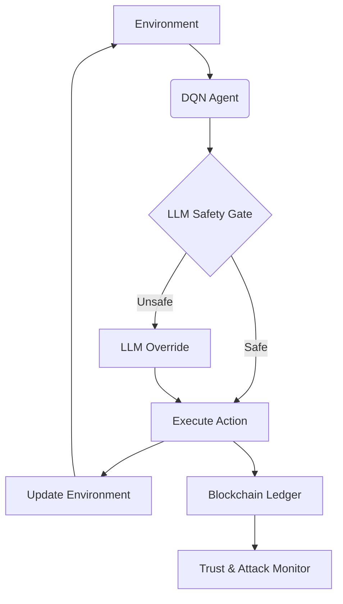

# 🛡️ **FedGuard: LLM-Enhanced Federated Reinforcement Learning for Network Security**

[](https://www.python.org/downloads/)
[](https://opensource.org/licenses/MIT)
[](https://github.com/psf/black)

**FedGuard** is an innovative network security system that combines **Federated Learning (FL)** , **Reinforcement Learning (DQN)** , and **Large Language Models (LLMs)** . It makes intelligent, decentralized security decisions while using **Blockchain** to create a secure, immutable audit trail.

---

## ✨ **Key Features**

| Feature | Description |
|---------|-------------|
| **🤖 Federated Learning** | Train models collaboratively across multiple clients without sharing raw data |
| **🧠 Deep Q-Network (DQN)** | Learn optimal security actions through environment interaction |
| **💬 LLM Integration** | Validate and override DQN actions using Groq's LLM API |
| **🔗 Blockchain Ledger** | Immutable recording of all security decisions and events |
| **📊 Trust & Attack Detection** | Real-time trust scoring and anomaly detection |

---

## 🏗️ **System Architecture**



---

## 🚀 **Getting Started**

### **Prerequisites**

- Python 3.8+
- `pip` (Python package installer)
- (Optional) Groq API key for live LLM features

### **Installation & Setup**

1. **Clone the repository**
   ```bash
   git clone https://github.com/ZawMyoOoytu/FedGuard.git
   cd FedGuard
   ```

2. **Create and activate a virtual environment (recommended)**
   ```bash
   python -m venv venv
   source venv/bin/activate  # On Linux/macOS
   .\venv\Scripts\activate   # On Windows
   ```

3. **Install required packages**
   ```bash
   pip install -r requirements.txt
   ```

4. **Configure environment variables**
   
   Create a `.env` file in the project root:
   ```
   GROQ_API_KEY=your_groq_api_key_here
   # Add other API keys as needed
   ```

### **Configuration**

Key parameters in `config.py`:

| Parameter | Description | Default |
|-----------|-------------|---------|
| `STATE_SIZE` | Environment state dimensions | `7` |
| `ACTION_SPACE` | Number of possible actions | `5` |
| `EPISODES` | Training episodes | `100` |
| `NUM_CLIENTS` | Federated learning clients | `3` |
| `FL_ROUNDS` | Federated learning rounds | `20` |
| `LIVE_LLM_ENABLED` | Enable/disable Groq LLM | `True` |
| `BLOCKCHAIN_DIFFICULTY` | Blockchain mining difficulty | `4` |

### **Usage**

Run the main training script:

```bash
python main.py
```

Results will be displayed in the console and saved to the `logs/` directory.

---

## 📊 **Sample Results**

The system shows progressive improvement in both reward and trust scores:

| Episode | Average Reward | Average Trust |
|---------|----------------|---------------|
| 0 | 52.31 | 1.00 |
| 5 | 54.11 | 1.00 |
| 10 | 58.83 | 1.00 |
| 15 | 54.73 | 0.92 |

The LLM successfully identifies and overrides unsafe DQN actions, preventing potentially harmful decisions.

---

## 📁 **Project Structure**

```
FedGuard/
├── main.py                 # Main entry point
├── config.py               # Configuration settings
├── requirements.txt        # Python dependencies
├── .env                    # Environment variables (gitignored)
├── .gitignore              # Git ignore rules
├── rl/                     # Reinforcement Learning module
│   └── dqn.py              # DQN Agent & Federated Learning
├── env/                    # Environment module
│   └── spectrum_env.py     # Network environment simulation
├── llm/                    # LLM module
│   ├── unified_llm.py      # Unified LLM interface
│   └── safe_space.py       # LLM-based safety validation
├── utils/                  # Utilities
│   └── logger.py           # Logging & Blockchain recording
├── logs/                   # Log files directory
└── models/                 # Trained models directory
```

---

## 🔍 **How It Works**

### **1. DQN Agent**
- Learns optimal actions through trial and error
- Uses experience replay and target networks for stable learning
- Explores vs. exploits using epsilon-greedy strategy

### **2. LLM Safety Gate**
- Validates DQN's proposed actions
- Overrides unsafe actions with safer alternatives
- Provides reasoning for overrides (e.g., "Maximum protection required due to high attack probability")

### **3. Blockchain Audit**
- Records all actions, overrides, and decisions
- Creates immutable, tamper-proof history
- Enables full audit trail for compliance

### **4. Trust System**
- Tracks system trustworthiness in real-time
- Detects anomalies and potential attacks
- Triggers alerts when trust drops below thresholds

---

## 🤝 **Contributing**

Contributions are welcome! Here's how:

1. Fork the repository
2. Create your feature branch (`git checkout -b feature/AmazingFeature`)
3. Commit your changes (`git commit -m 'Add some AmazingFeature'`)
4. Push to the branch (`git push origin feature/AmazingFeature`)
5. Open a Pull Request

---

## 📜 **License**

This project is licensed under the MIT License - see the [LICENSE](LICENSE) file for details.

---

## 🙏 **Acknowledgments**

- [PyTorch](https://pytorch.org/) for deep learning framework
- [Groq](https://groq.com/) for LLM API
- [OpenAI](https://openai.com/) for inspiration and tools

---

## ⚠️ **Disclaimer**

This project is for **research and educational purposes only**. It is not production-ready and should be thoroughly tested before any real-world deployment. Use at your own risk.

---

**Made with ❤️ by ZawMyoOoytu**

---


**Then visit your repository:** 👉 https://github.com/ZawMyoOoytu/FedGuard

---

